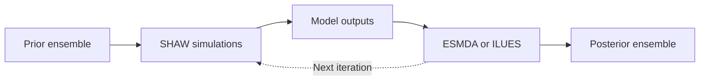

<div align="center">
SHAW–ESMDA–ILUES
A parameter-inversion framework coupling the SHAW model with ESMDA and ILUES


</div>
Overview
This repository provides a Python workflow for estimating parameters of the Simultaneous Heat and Water (SHAW) model and quantifying posterior uncertainty with two ensemble smoothers:
ESMDA — Ensemble Smoother with Multiple Data Assimilation (also written ES-MDA)
ILUES — Iterative Local Updating Ensemble Smoother
The framework connects prior-ensemble generation, batch SHAW simulations, iterative parameter updating, result evaluation, and visualization. It was developed for parameter inversion using observations such as soil liquid water content and for evaluating posterior simulations of related variables such as soil temperature.
Item	Description
Forward model	SHAW 3.03
Inversion algorithms	ESMDA and ILUES
Language	Python 3
Current platform	Windows-compatible environment for `SHAW303.EXE`
Main outputs	Posterior parameters, state ensembles, uncertainty intervals, and diagnostic figures
Workflow

Features
SHAW parameter mapping and automatic input-file rewriting
ESMDA and ILUES parameter-update workflows
Configurable ensemble size and assimilation iterations
Batch simulation, runtime tracking, and execution-error handling
Posterior quantiles and ensemble-spread analysis
Parameter-distribution, time-series, soil-profile, and evaluation plots
RMSE, Nash–Sutcliffe efficiency (NSE), and coefficient of determination (R²)
Quick Start
1. Clone the repository
```bash
git clone https://github.com/WangXk6666/SHAW-ESMDA-ILUES-inversion-framework.git
cd SHAW-ESMDA-ILUES-inversion-framework
```
2. Create the Python environment
```powershell
py -m venv .venv
.venv\Scripts\Activate.ps1
python -m pip install -r requirements.txt
```
Principal dependencies include `numpy`, `scipy`, `pandas`, `matplotlib`, `pyecharts`, and `tqdm`. See `requirements.txt` for the complete list.
3. Install SHAW
Download SHAW 3.03 from the official USDA-ARS SHAW page. Place `SHAW303.EXE` and the required model files in the location expected by `SHAW/SHAW_exe.py`.
SHAW is not installed through `pip` and is not licensed under this project's MIT License.
4. Configure the experiment
Prepare the SHAW inputs, observations, and prior parameter samples under `TEST_SHAW/Model/`. Then open `SHAW/RUNTHIS.py` and check:
algorithm selection;
ensemble size and number of iterations;
inflation factors and observation-error settings;
parameter bounds and mappings;
observation variables, depths, times, and units; and
input, executable, and output paths.
5. Run
```powershell
python SHAW/RUNTHIS.py
```
Results are written to `TEST_SHAW/Ensemble/`, and figures are saved in `TEST_SHAW/Figures/`.
> **Demo settings:** the example uses 20 ensemble members and one assimilation iteration for a quick execution test. These settings are not sufficient for scientific inference; ensemble convergence and posterior stability must be evaluated for each application.
Repository Layout
<details>
<summary><strong>Show repository tree</strong></summary>
```text
SHAW-ESMDA-ILUES-inversion-framework/
├── General/
│   ├── draw_prior_sample.py    # Prior-ensemble generation or import
│   ├── ES_K_update.py          # Ensemble-smoother update
│   ├── local_update_for.py     # ILUES local update
│   └── obs_read.py             # Observation reader
├── SHAW/
│   ├── MAINPROGRESS.py         # Main workflow
│   ├── P.py                    # Parameter mapping
│   ├── RUNTHIS.py              # Configuration and entry point
│   ├── SHAW_exe.py             # SHAW303.EXE runner
│   ├── SHAWParRewrite.py       # SHAW input rewriting
│   ├── SHAWSimRead.py          # Standard-output reader
│   ├── SingleResultReader.py   # Selected-output reader
│   ├── SoluteReader.py         # Solute-output reader
│   └── WaterBalanceReader.py   # Water-balance reader
├── SHAWFinalResult/
│   ├── Distribution.py         # Parameter distributions
│   ├── PlotIterationPar.py     # Parameter trajectories
│   ├── PlotResult.py           # Simulation results
│   ├── Quantile.py             # Posterior quantiles
│   └── ReadFinal.py            # Final-result reader
├── TEST_SHAW/
│   ├── Ensemble/               # Numerical results
│   ├── Figures/                # Generated figures
│   └── Model/                  # SHAW inputs and working files
├── requirements.txt
├── README.md
└── LICENSE
```
</details>
Do not rename SHAW input or output files unless the corresponding paths and readers are updated. Keep a backup of the original model inputs because the workflow rewrites parameter files during ensemble simulations.
Main Outputs
Example output	Description
`ensemble_*_X_K_f_moi.csv`	Simulated liquid-water-content ensemble
`ensemble_*_X_K_f_temp.csv`	Simulated soil-temperature ensemble
`Quantile_moi.csv`	Posterior interval for liquid water content
`Quantile_temp.csv`	Posterior interval for soil temperature
`joint_distribution_*.png`	Joint posterior parameter distribution
`PlotIterationPar.py` outputs	Parameter trajectories across iterations
Some filenames contain algorithm or iteration identifiers. Check the post-processing scripts before changing the naming convention.
Citation
If this framework contributes to a publication, cite this repository together with the original SHAW, ESMDA, and ILUES publications used in the analysis.
```bibtex
@software{wang_shaw_esmda_ilues_2026,
  author = {Wang, Xueke},
  title  = {SHAW--ESMDA--ILUES Parameter Inversion Framework},
  year   = {2026},
  url    = {https://github.com/WangXk6666/SHAW-ESMDA-ILUES-inversion-framework}
}
```
License and Attribution
The MIT License applies only to the integration and extension code written by Xueke Wang, including author-owned workflow control, parameter mapping, input/output processing, evaluation, and visualization code.
SHAW, ESMDA, and ILUES remain the work of their original authors:
The SHAW program and documentation are attributed to Gerald N. Flerchinger and collaborators at USDA-ARS.
ESMDA is attributed to Emerick and Reynolds.
ILUES is attributed to Zhang and co-authors.
SHAW and any third-party ESMDA or ILUES implementations are not relicensed under this repository's MIT License. Their original copyright notices, licenses, and citation requirements must be retained. Academic citation does not replace any permission required to redistribute third-party source code or executable files.
References
Flerchinger, G. N., & Saxton, K. E. (1989). Simultaneous heat and water model of a freezing snow-residue-soil system. I. Theory and development. Transactions of the ASAE, 32(2), 565–571.
Flerchinger, G. N. (2000). The Simultaneous Heat and Water (SHAW) Model: Technical Documentation. USDA-ARS Technical Report NWRC 2000-09.
Flerchinger, G. N., Caldwell, T. G., Cho, J., & Hardegree, S. P. (2012). Simultaneous Heat and Water Model: Model use, calibration, and validation. Transactions of the ASABE, 55(4), 1395–1411. https://doi.org/10.13031/2013.42250
Emerick, A. A., & Reynolds, A. C. (2013). Ensemble smoother with multiple data assimilation. Computers & Geosciences, 55, 3–15. https://doi.org/10.1016/j.cageo.2012.03.011
Zhang, J., Lin, G., Li, W., Wu, L., & Zeng, L. (2018). An iterative local updating ensemble smoother for estimation and uncertainty assessment of hydrologic model parameters with multimodal distributions. Water Resources Research, 54(3), 1716–1733. https://doi.org/10.1002/2017WR020906
Contact
Xueke Wang (汪学科) · Chang'an University  
WangXk6666@outlook.com · GitHub
For reproducible bug reports, open a GitHub Issue and include the operating system, Python version, relevant configuration, and complete error traceback.
